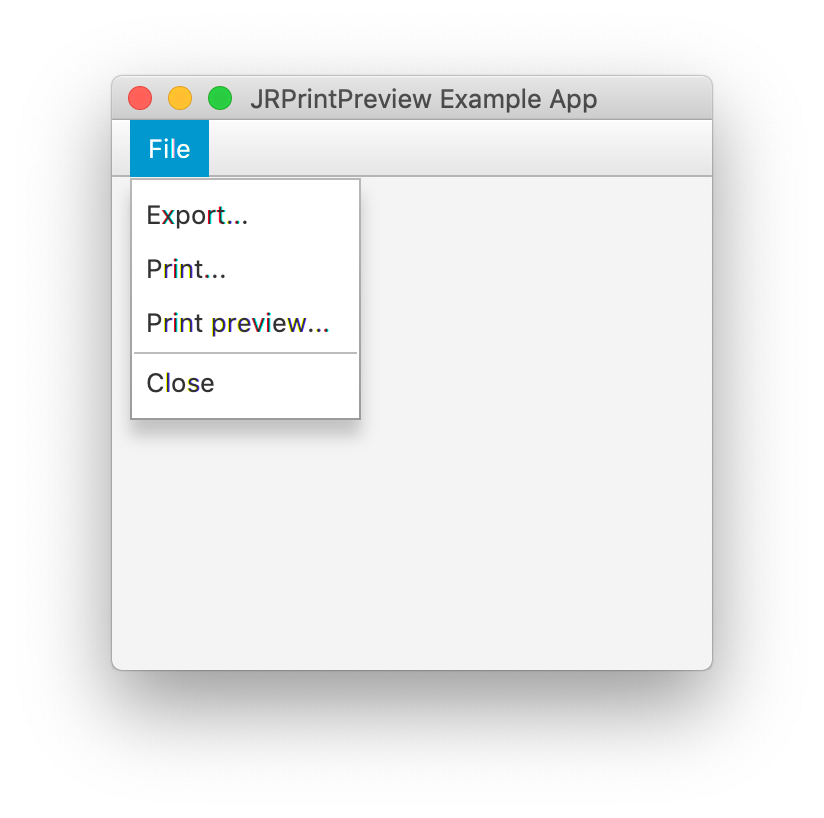

# JRPrintPreview

[](https://travis-ci.com/prsolucoes/jrprintpreview)  

JasperReports print preview stage class written in JavaFX 12  

## Usage example

Whole functionality is contained in a `JRPrintPreview.java` file. This file should be copied to your project. The rest of the files represent an example project which demonstrates print preview functionality for one simple JasperReports report.

Basic usage is shown in the next example.

```
String reportFileName = "SomeReport.jasper";
Map<String, Object> paramMap = new HashMap<>();
JRBeanCollectionDataSource dataSource = new JRBeanCollectionDataSource(...);

JasperReport jasperReport = (JasperReport) JRLoader.loadObject(
	JRLoader.getResourceInputStream(reportFileName)
);

JasperPrint jasperPrint = JasperFillManager.fillReport(
	jasperReport, paramMap, dataSource
);

JRPrintPreview printPreview = new JRPrintPreview(jasperPrint);
printPreview.show();
```

## Commands

Some maven commands are available and you can execute it without IDE, including run the sample application:  

```
mvn clean
mvn compile
mvn javafx:run
```

## Requirements

You need Java 12 to run it.  

Obs: If you use Java 8, Java 9 or other you need change file **pom.xml** to 1.8, 1.9 or other version in elements **source**, **target** and **release** of configuration tag.  

## Screenshots

  


## Known bugs

**Problem 1:**

On macOS Mojave i receive this error when click on **"Print"** menu item:

```
2019-08-08 19:52:13.813 java[58472:3733930] 	Cocoa AWT: Running on AppKit thread 0 when not expected. (
	0   libawt_lwawt.dylib                  0x000000012d871fac nsPrintInfoToJavaPageFormat + 49
	1   libawt_lwawt.dylib                  0x000000012d871dfa Java_sun_lwawt_macosx_CPrinterJob_getDefaultPage + 49
	2   ???                                 0x000000010dcd8990 0x0 + 4526541200
)
2019-08-08 19:52:13.813 java[58472:3733930] 	Please file a bug report at http://bugreport.java.com/bugreport with this message and a reproducible test case.
```

I tested it with JDK 1.8.221 and JDK 12.